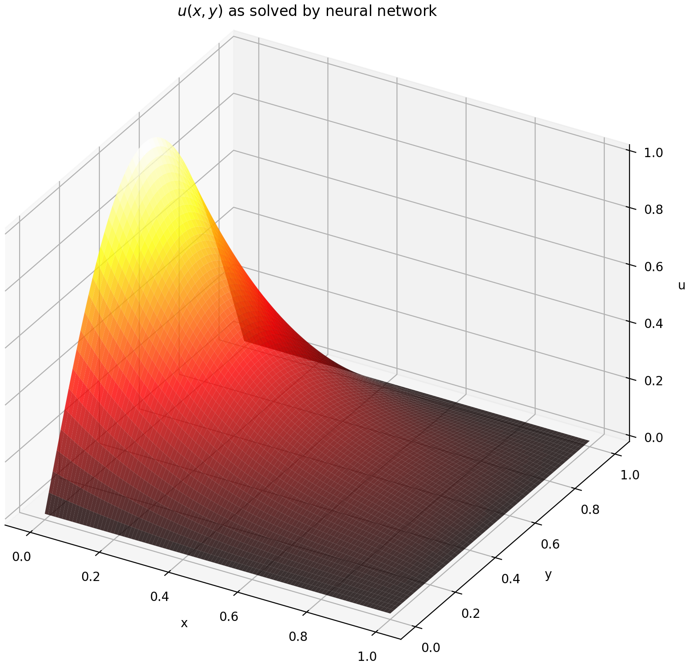
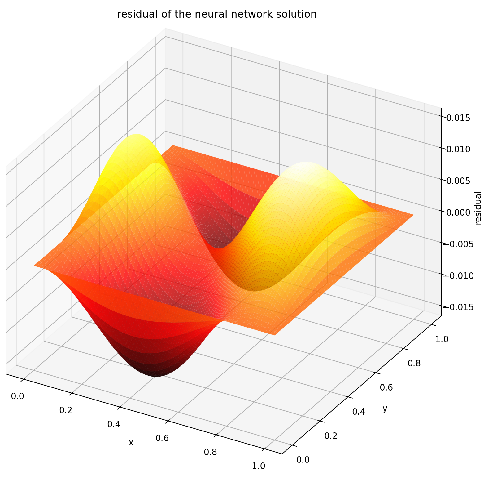
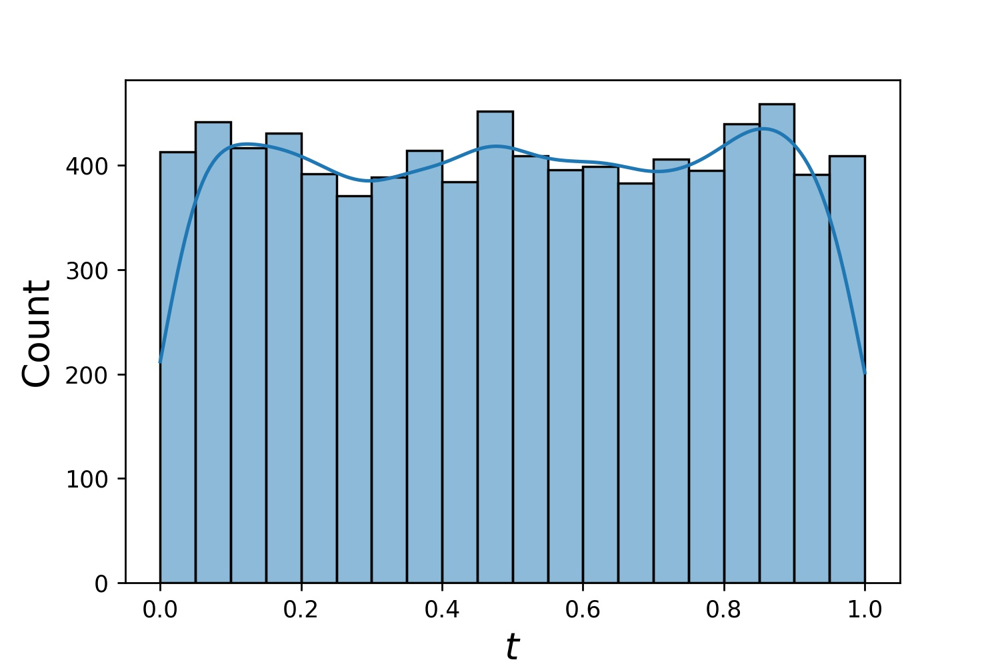
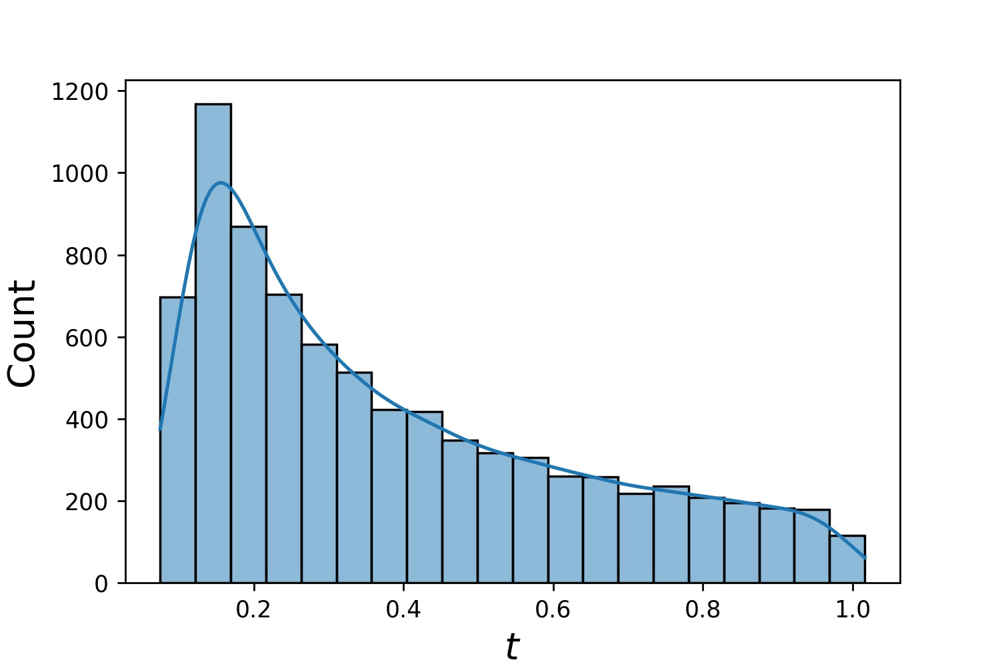
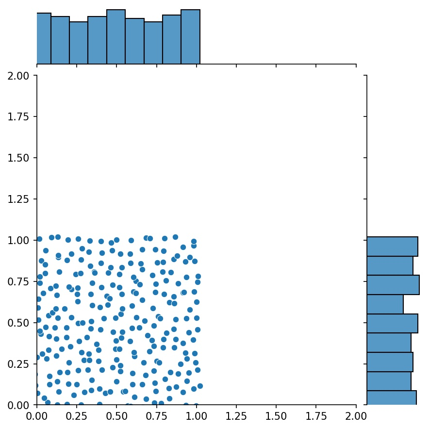
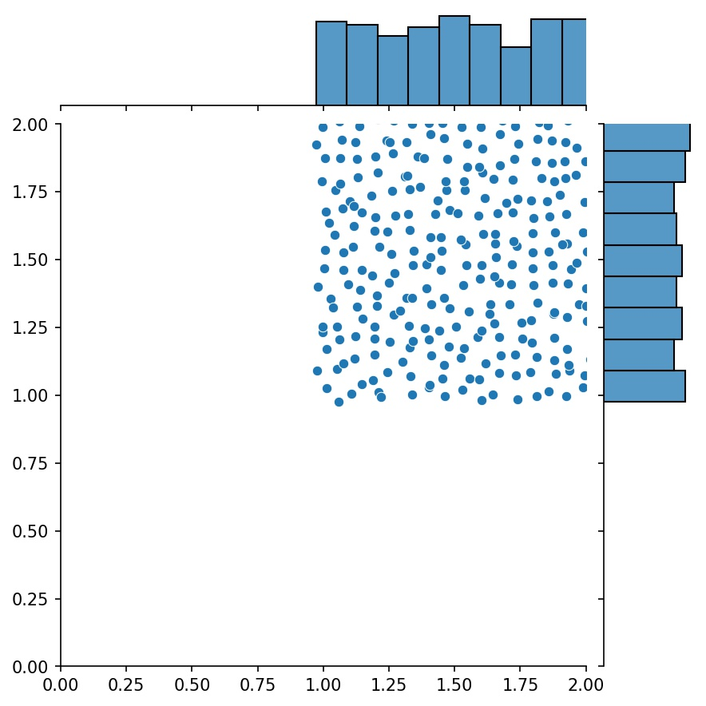
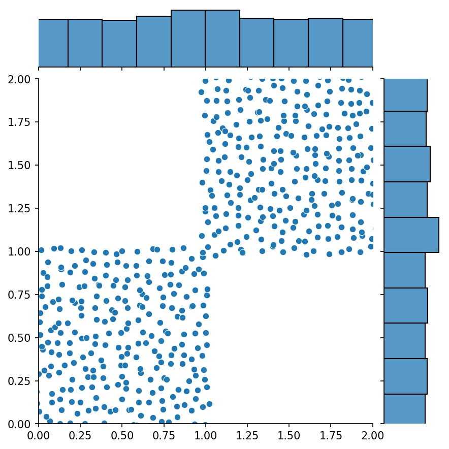
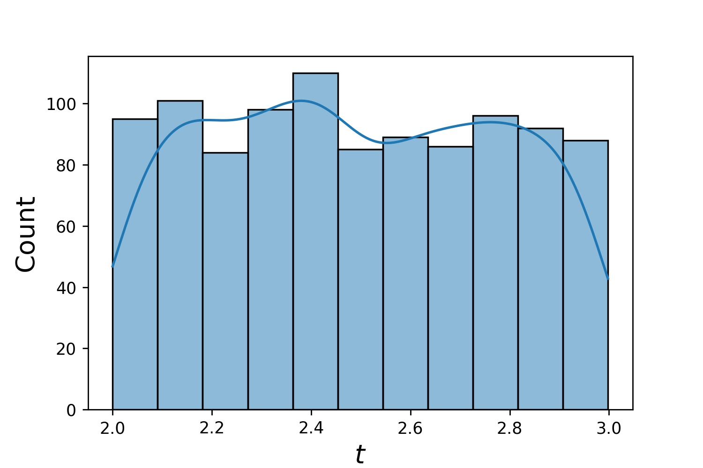
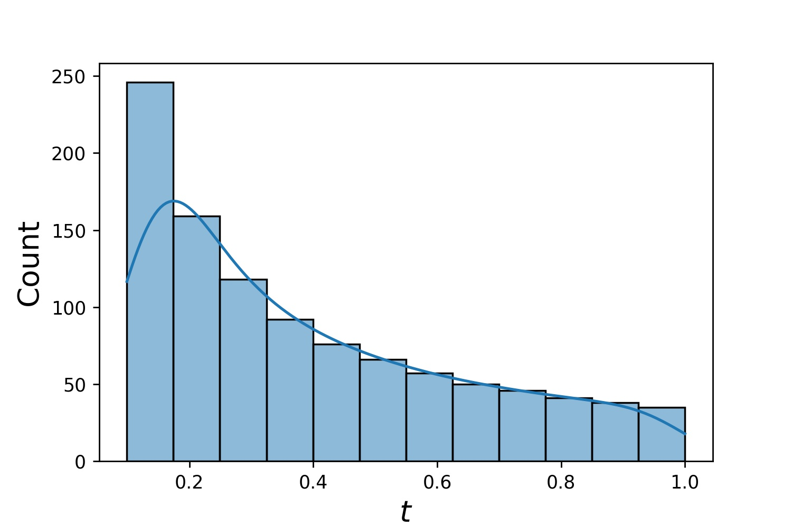

# neurodiffeq

[](https://app.codacy.com/gh/odegym/neurodiffeq?utm_source=github.com&utm_medium=referral&utm_content=odegym/neurodiffeq&utm_campaign=Badge_Grade_Settings)
  [](https://travis-ci.org/odegym/neurodiffeq) [](https://codecov.io/gh/odegym/neurodiffeq) [](https://neurodiffeq.readthedocs.io/en/latest/?badge=latest) [](https://doi.org/10.21105/joss.01931)

# Introduction

`neurodiffeq` is a package for solving differential equations with neural networks. Differential equations are equations that relate some function with its derivatives. They emerge in various scientific and engineering domains. Traditionally these problems can be solved by numerical methods (e.g. finite difference, finite element). While these methods are effective and adequate, their expressibility is limited by their function representation. It would be interesting if we can compute solutions for differential equations that are continuous and differentiable.

As universal function approximators, artificial neural networks have been shown to have the potential to solve ordinary differential equations (ODEs) and partial differential equations (PDEs) with certain initial/boundary conditions. The aim of `neurodiffeq` is to implement these existing techniques of using ANN to solve differential equations in a way that allow the software to be flexible enough to work on a wide range of user-defined problems.

<p align='center'>
  <a href='https://youtu.be/VDLwyFD-sXQ'>
    
  </a>
</p>

# Installation

## Install via pip

Like most standard libraries, `neurodiffeq` is hosted on [PyPI](https://pypi.org/project/neurodiffeq/). To install the latest stable relesase, simply use the `pip` (or `pip3`) tool.

```sh
pip install neurodiffeq 
# or try: pip3 install neurodiffeq
```

## Manual Install

Alternatively, you can install the library manually to get early access to our new features. This is the recommended way for developers who want to contribute to the library.

1. (optional) Create a new environment. With `conda`: `conda create --name [name of the new environment] python=3.7` and activate the enviroment by `conda activate  [name of the new environment]`; With `venv`: `python3 -m venv temp [path to the new environment]` and activate the environment by `source [path to the new environment]/bin/activate`
2. Clone the repo by `git clone https://github.com/odegym/neurodiffeq.git` and `cd` into the root directory of the repo by `cd neurodiffeq`
3. Install the dependencies by `pip install -r requirements.txt` and install `neurodiffeq` by `pip install .`
4. (optional) Run tests `cd tests && pytest`

1. (optional) Deactivate the environment. With `conda`: `conda deactivate`; With `venv`: `deactivate`

# Getting Started

To view complete tutorials and documentation of `neurodiffeq`, please check [Official Documentation](https://neurodiffeq.readthedocs.io/en/latest/). 

In addition to the documentations, we have recently made a quick walkthrough [Demo Video](https://youtu.be/VDLwyFD-sXQ), the slides can be found [here](https://drive.google.com/file/d/1XTbwkZ0g7ufzD7lvMB-Cl8s5nh6jKgHk/view?usp=sharing).

## Example Usages

### Imports

```python
from neurodiffeq import diff
from neurodiffeq.solvers import Solver1D, Solver2D
from neurodiffeq.conditions import IVP, DirichletBVP2D
from neurodiffeq.networks import FCNN, SinActv
```

### ODE System Example

Here we solve a non-linear system of two ODEs, known as the [Lotka–Volterra](https://en.wikipedia.org/wiki/Lotka–Volterra_equations) equations. There are two unknown functions (`u` and `v`) and a single independent variable (`t`).

```python
def ode_system(u, v, t): 
    return [diff(u,t)-(u-u*v), diff(v,t)-(u*v-v)]

conditions = [IVP(t_0=0.0, u_0=1.5), IVP(t_0=0.0, u_0=1.0)]
nets = [FCNN(actv=SinActv), FCNN(actv=SinActv)]

solver = Solver1D(ode_system, conditions, t_min=0.1, t_max=12.0, nets=nets)
solver.fit(max_epochs=3000)
solution = solver.get_solution()
```

`solution` is a callable object, you can pass in numpy arrays or torch tensors to it like

```python
u, v = solution(t, to_numpy=True)  # t can be np.ndarray or torch.Tensor
```

Plotting `u` and `v` against their analytical solutions yields something like:


### PDE System Example

Here we solve a Laplace Equation with Dirichlet boundary conditions on a rectangle. Note that we choose Laplace equation for its simplicity of computing analytical solution. **In practice, you can attempt any nonlinear, chaotic PDEs**, provided you tune the solver well enough.

Solving a 2-D PDE system is quite similar to solving ODEs, except there are *two* variables `x` and `y` for boundary value problems or `x` and `t` for initial boundary value problems, both of which are supported.

```python
def pde_system(u, x, y):
    return [diff(u, x, order=2) + diff(u, y, order=2)]

conditions = [
    DirichletBVP2D(
        x_min=0, x_min_val=lambda y: torch.sin(np.pi*y),
        x_max=1, x_max_val=lambda y: 0,                   
        y_min=0, y_min_val=lambda x: 0,                   
        y_max=1, y_max_val=lambda x: 0,                   
    )
]
nets = [FCNN(n_input_units=2, n_output_units=1, hidden_units=(512,))]

solver = Solver2D(pde_system, conditions, xy_min=(0, 0), xy_max=(1, 1), nets=nets)
solver.fit(max_epochs=2000)
solution = solver.get_solution()
```

The signature of `solution` for a 2D PDE is slightly different from that of an ODE. Again, it takes in either numpy arrays or torch tensors.

```python
u = solution(x, y, to_numpy=True)
```
Evaluation u on points meshgrids in `[0,1] × [0,1]` yields the following plots

|                 ANN-Based Solution                  |           Error against Analytical Solution                  |
| :-------------------------------------------------: | :----------------------------------------------------------: |
|  |                 |

### Using a Monitor

A monitor is a tool for visualizing PDE/ODE solutions as well as history of loss and custom metrics during training. Jupyter Notebooks users need to run the `%matplotlib notebook` magic. For Jupyter Lab users, try `%matplotlib widget`. 

```python
from neurodiffeq.monitors import Monitor1D
...
monitor = Monitor1D(t_min=0.0, t_max=12.0, check_every=100)
solver.fit(..., callbacks=[monitor.to_callback()])
```

You should see the plots update *every 100 epoch* as well as *on the last epoch*, showing two plots — one for solution visualization on the interval `[0,12]` and the other for loss history (training and validation). 


### Custom Networks

For convenience, we have implemented an `FCNN` – fully-connected neural network, whose hidden units and activation functions can be customized. 

```python
from neurodiffeq.networks import FCNN
# Default: n_input_units=1, n_output_units=1, hidden_units=[32, 32], activation=torch.nn.Tanh
net1 = FCNN(n_input_units=..., n_output_units=..., hidden_units=[..., ..., ...], activation=...) 
...
nets = [net1, net2, ...]
```

`FCNN` is usually a good starting point. For advanced users, solvers are compatible with any custom `torch.nn.Module`. The only constraints are:

1. The modules takes in a tensor of shape `(None, n_coords)` and the outputs a tensor of shape `(None, 1)`. 

2. There must be a total of `n_funcs` modules in `nets` to be passed to `solver = Solver(..., nets=nets)`.


*Acutally, `neurodiffeq` has a **single_net** feature that doesn't obey the above rules, which won't be covered here.*

Read the PyTorch [tutorial](https://pytorch.org/docs/stable/notes/modules.html) on building your own network (a.k.a module) architecture. 

### Transfer Learning

Transfer learning is easily done by serializing `old_solver.nets` (a list of torch modules) to disk and then loading them and passing to a new solver:

```python
old_solver.fit(max_epochs=...)
# ... dump `old_solver.nets` to disk

# ... load the networks from disk, store them in some `loaded_nets` variable
new_solver = Solver(..., nets=loaded_nets)
new_solver.fit(max_epochs=...)
```

We currently working on wrapper functions to save/load networks and other internal variables of Solvers. In the meantime, you can read the PyTorch [tutorial](https://pytorch.org/tutorials/beginner/saving_loading_models.html) on saving and loading your networks.

### Sampling Strategies

In neurodiffeq, the networks are trained by minimizing loss (ODE/PDE residuals) evaluated on a set of points in the domain. The points are randonly resampled every time. To control the number, distribution, and bounding domain of sampled points, you can specify your own training/valiadation `generator`s.

```python
from neurodiffeq.generators import Generator1D

# Default t_min=0.0, t_max=1.0, method='uniform', noise_std=None
g1 = Generator1D(size=..., t_min=..., t_max=..., method=..., noise_std=...)
g2 = Generator1D(size=..., t_min=..., t_max=..., method=..., noise_std=...)

solver = Solver1D(..., train_generator=g1, valid_generator=g2)
```

Here are  some sample distributions of a `Generator1D`.

|      `Generator1D(8192, 0.0, 1.0, method='uniform')`      | `Generator1D(8192, -1.0, 0.0, method='log-spaced-noisy', noise_std=1e-3)` |
| :-------------------------------------------------------: | :----------------------------------------------------------: |
|  |  |


Note that when both `train_generator` and `valid_generator` are specified, `t_min` and `t_max` can be omitted in `Solver1D(...)`. In fact, even if you pass `t_min`, `t_max`, `train_generator`, `valid_generator` together, the `t_min` and `t_max` will still be ignored.

#### Combining Generators

Another nice feature of the generators is that you can concatenate them, for example 

```python
g1 = Generator2D((16, 16), xy_min=(0, 0), xy_max=(1, 1))
g2 = Generator2D((16, 16), xy_min=(1, 1), xy_max=(2, 2))
g = g1 + g2
```

Here, `g` will be a generator that outputs the combined samples of `g1` and `g2`

|                     `g1`                      |                     `g2`                      |                        `g1 + g2`                        |
| :-------------------------------------------: | :-------------------------------------------: | :-----------------------------------------------------: |
|  |  |  |

#### Sampling Higher Dimensions

You can use `Generator2D`, `Generator3D`, etc. for sampling points in higher dimensions. But there's also another way

```python
g1 = Generator1D(1024, 2.0, 3.0, method='uniform')
g2 = Generator1D(1024, -1.0, 0.0, method='log-spaced-noisy', noise_std=0.001)
g = g1 * g2
```

Here, `g` will be a generator which yields 1024 points in a 2-D rectangle `(2,3) × (0.1,1)` every time. The x-coordinates of them are drawn from `(2,3)` using strategy `uniform` and the y-coordinate drawn from `(0.1,1)` using strategy `log-spaced-noisy`.

|                      `g1`                       |                      `g2`                       |                          `g1 * g2`                           |
| :---------------------------------------------: | :---------------------------------------------: | :----------------------------------------------------------: |
|  |  |  |

# FAQ

#### Q: How to use GPU for training?

Simple. When importing neurodiffeq, the library automatically detects if CUDA is available on your machine. Since the library is based on PyTorch, it will set default tensor type to `torch.cuda.DoubleTensor` for GPU acceleration.

#### Q: How to use pretrained nets?

Refer to Sections [Custom Networks](#custom-networks) and [Transfer Learning](#transfer-learning).

#### Q: I got a bad solution.

Unlike traditional numerial methods (FEM, FVM, etc.), the NN-based solution requires some hypertuning. The library offers the utmost flexibility to try any combination of hyperparameters.

- To use a different network architecture, you can pass in your custom `torch.nn.Module`s.
- To use a different optimizer, you can pass in your own optimizer to `solver = Solver(..., optimizer=my_optim)`. 
- To use a different sampling distribution, you can use [predefined generators](https://neurodiffeq.readthedocs.io/en/latest/api.html#module-neurodiffeq.generators) or write your own generators from scratch.
- To use a different sampling size, you can tweak the generators or change `solver = Solver(..., n_batches_train)`.
- To dynamically change hyperparameters during training, checkout our [callbacks](https://neurodiffeq.readthedocs.io/en/latest/api.html#module-neurodiffeq.callbacks) feature.

#### Q: Any rules of thumbs?

- Don't use `ReLU` for activation, because its second-order derivative is identically 0.
- Re-scale your PDE/ODE in dimensionless form, preferably make everything range in `[0,1]`. Working with a domain like `[0,1000000]` is prone to failure because **a)** PyTorch initializes the modules weights to be relatively small and **b)** most activation functions (like Sigmoid, Tanh, Swish) are most nonlinear near 0.
- If your PDE/ODE is too complicated, consider trying curriculum learning. Start training your networks on a smaller domain, and then gradually expand until the whole domain is covered.

# Contributing

Everyone is welcome to contribute to this project.

When contributing to this repository, we consider the following process:

1. Open an issue to discuss the change you are planning to make.
2. Go through [Contribution Guidelines](CONTRIBUTING.md).
3. Make the change on a forked repository and update the README.md if changes are made to the interface.
4. Open a pull request. 
